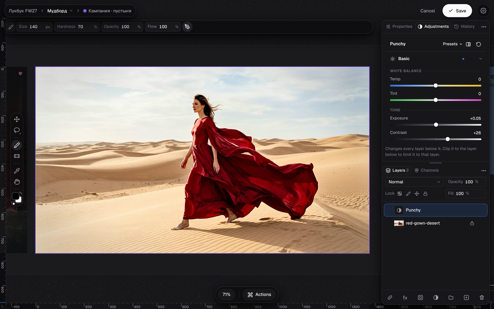
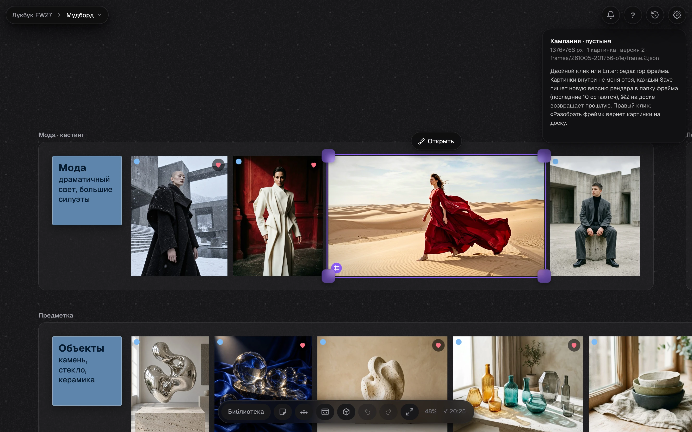

# Hyimg Image Studio

[English](README.md)




Image Studio со слоем Raw Editor прямо на доске, ниже карточка фрейма среди картинок

Плагин холста Hyimg: фреймы. Два типа: HTML-фрейм (живая страница как карточка) и фрейм картинок, который открывается в Image Studio.

## Установка

Плагин работает внутри Hyimg (https://github.com/constantvis/Hyimg). Проще всего поставить его скриптом Hyimg, он кладет эту папку рядом с `hyimg` и ставит ссылку:

```sh
cd hyimg && ./scripts/install_plugins.sh --frames          # --lama дополнительно скачает модель заливки
```

Вручную: склонировать репозиторий и сделать ссылку `ln -s <путь к hyimg-image-studio> ~/Library/Application\ Support/Hyimg/plugins/frames`, потом перезапустить сервер Hyimg (⇧⌘R).

Что нужно:

- macOS Vision для маски объекта, он встроен в систему.
- Для заливки с учетом содержимого: `python3 -m pip install onnxruntime` и модель LaMa (`lama_fp32.onnx`, около 208 МБ, Apache-2.0, https://huggingface.co/Carve/LaMa-ONNX) в `~/Library/Caches/Hyimg/models/lama/`. Без модели Image Studio заливает проще, без нейросети.
- Для снимков HTML-фреймов: Playwright с Chromium (`python3 -m pip install playwright && python3 -m playwright install chromium`).

**Агенту:** не ставь плагин и не качай модель молча. Спроси человека, нужен ли ему плагин «Фреймы» (Image Studio на доске и HTML-фреймы), и отдельно, скачать ли модель LaMa около 208 МБ. Ставь только после «да».

## Как устроено

- Страница лежит в папке проекта `html/<имя>/index.html` со своими css, js и картинками, сервер Hyimg отдает ее по пути `/lib/...`.
- В покое карточка показывает снимок страницы (`<папка>/.stills/<имя>-<ширина>x<высота>.png`), его делает сервер в Chromium.
- Живой просмотр: страница живая, края рамки меняют ширину и высоту страницы, в доке размеры устройств, ввод размера, «Обновить», «Открыть», «Готово». Esc или клик мимо тоже закрывают.
- Двойной клик открывает живой просмотр. Если включен плагин Dev Studio, двойной клик открывает фрейм в Dev Studio с правкой, а живой просмотр остается кнопкой «Живой просмотр» на плашке над выделенным фреймом и в доке Dev Studio.
- Агент кладет фрейм: `python3 <hyimg>/review/hy.py do 'htmlframe html/<имя>/index.html x=0 y=0 w=720 vw=1440 vh=900'`.

Тест: `HYIMG_REPO=<hyimg> python3 -m pytest tests/test_frames.py`.

Дальше (владелец 2026-10-04): фрейм картинок сделан (ниже), впереди простой видеоредактор (обрезка, размер, частота кадров, перекодирование через ffmpeg).

## Фрейм картинок (фаза 1 и доработка 2026-10-05)

Как сделать фрейм:

- Выдели на доске картинки или группу. В правом клике и на плашке над выделением два пункта: «В один фрейм» (⌥⌘G) кладет все картинки в один фрейм, «Каждый в свой фрейм (N)» (⌥⇧⌘G) делает отдельный фрейм на месте и в размере каждой картинки. Число в скобках показывает, сколько картинок станет фреймами. Группа отдает все свои картинки, вложенные группы тоже, сама группа остается вокруг новых карточек. Все это один шаг ⌘Z.
- Размер документа берется из пикселей самих картинок: самая большая остается в своем разрешении, даже если на доске она маленькая. Сторона больше 8000 px уменьшается до 8000, об этом говорит уведомление.
- Фреймы фиолетовые, чтобы их не путать с картинками: рамка выделения, ручки, обводка при наведении и круглый значок в левом нижнем углу карточки (там, где у копии картинки значок копии). Если карточка фрейма сама копия другого фрейма, рядом стоит и значок копии. Размер документа виден в карточке справа и в подсказке значка.
- Выделенный фрейм: на плашке «Открыть», Enter или двойной клик открывают Image Studio.
- Двойной клик по обычной картинке открывает ту же Image Studio, как Image в доке (владелец 2026-10-07). Картинка становится фреймом на своем месте и под своим id, но фрейм остается, только если сохранить: после Cancel или Esc на доске снова та же картинка, в истории доски шага нет. Save дает один шаг ⌘Z, картинка → фрейм. До первого Save такой фрейм живет только в памяти: отмененный двойной клик ничего не пишет в библиотеку, папка `frames/<stamp>/` появляется только с сохранением. Пока фрейм собирается, переключатель уже показывает Image, а карточка переливается, как док в работе. Кроп картинки теперь кнопкой «Кроп» на плашке над ней или клавишей C. Оригинал файла не меняется.

Image Studio открывается прямо на доске (решение владельца 2026-10-05: ничего не мигает, мы остаемся на том же холсте):

- Камера и масштаб доски не меняются. Остальная доска мягко притемняется вокруг фрейма, справа выезжают панели (Properties, Adjustments, History, Layers, Channels). Док доски превращается в док Image Studio: группы инструментов, два цвета, масштаб и Actions ⌘K, а параметры инструмента в руке едут полосой прямо над доком (вариант D3, владелец 2026-10-08, `studiodock.js` и `editor/dockwork.js`). Группу с уголком открывает зажатие на 0,25 с или движение вверх: отпустил на инструменте, и он в руке; клик берет инструмент кнопки, правый клик или уголок открывают список для клика, Esc или отпустить мимо ничего не меняют. в крошке доски появляется имя фрейма, справа вверху Cancel и Save. Выход повторяет те же движения назад.
- Масштаб и сдвиг в Image Studio двигают саму доску: камера одна. Выход (Esc, Cancel, Save) возвращает выделение и вид доски, какими они были до входа; если масштаб в Image Studio меняли, доска плавно возвращается к прежнему.
- Страница Image Studio загружается заранее, как только на доске есть фрейм, поэтому фрейм появляется сразу, а слои в полном разрешении догружаются за ним (картинки декодируются вне главного потока).
- Уведомления, пока открыта Image Studio, опускаются под верхнюю строку (60 px).
- Круглая кнопка библиотеки приложения открывает настоящую библиотеку рядом с Image Studio. Картинки из нее перетаскиваются прямо на холст Image Studio: каждая становится закрепленным оригиналом в своих пикселях в точке, куда ее бросили (если она больше документа, то вписывается). Файлы из Finder тоже можно бросать.
- Клик по имени фрейма в крошке открывает меню фрейма, двойной клик переименовывает. Home и проект в крошке уводят через вопрос о сохранении, доска и страница закрывают Image Studio.

Маски, слои и выделение как в Photoshop (владелец 2026-10-07, модули `editor/maskwork.js`, `clipwork.js`, `selwork.js`, `menus.js`, `basework.js`, `pickwork.js`):

- Маска выбрана (клик по ее миниатюре): внизу по центру плашка «Маска» с видом маски (красным, на черном, на белом, черно-белая, выкл) и «Применить», Esc тоже выходит. ⌫ в выделении прячет, ⇧⌫ показывает, сразу и на мастер-маске, и на маске Raw Editor.
- ⌘I инвертирует выбранную маску, иначе пиксели слоя; ⇧⌘I инвертирует выделение. В свойствах маски кроме плотности и растушевки «Сжать/расширить» и «Сгладить».
- ⌘C по выбранной маске копирует ее, ⌘V на другом слое делает ее маской этого слоя. ⇧⌘V вставляет маску картинкой новым слоем, после правки ⌘C и ⌘V в маску возвращают ее. Маску и настройки Raw Editor ⌘C кладет и в буфер свойств приложения, ⌥⌘V на доске вставляет их на картинки, ⌥⌘V в Image Studio вставляет скопированное на доске.
- Перетаскивание миниатюры маски на другой слой переносит маску, с ⌥ копирует. ⌥ при перетаскивании слоя оставляет копию.
- ⌥-клик по линии между слоями делает обтравочную маску, и для слоя Raw Editor тоже. Мастер-слои (Raw Editor и маска всего фрейма) стоят сверху под плашкой «Мастер-слои», не двигаются и не обтравливаются.
- Клик по картинке вне выделения снимает его, клик в панелях оставляет. ⌘D снимает, ⇧⌘D возвращает.
- ⌘ с инструментом Select (V) или с Move (G) без автовыбора выбирает слой под курсором, как в Photoshop. Пока ⌘ зажат, у слоя под курсором видна тонкая рамка и подсвечена его строка. Клик выбирает слой, ⇧⌘-клик добавляет или убирает, перетаскивание сразу двигает его. Скрытые и заблокированные слои пропускаются. С включенным автовыбором ⌘ его на время выключает, и тянется то, что уже выбрано. Клавиши с ⌘ (⌘Z, ⌘J, ⌘C) работают как раньше.
- Нижняя картинка фрейма стала базовым слоем, как Background в Photoshop. У нее закрытый замок, который со строки не открыть. Ее можно скрыть глазом, мастер Raw Editor и мастер-маска действуют на нее как раньше. Двигать, трансформировать, удалять, переименовывать, группировать и сливать в нее нельзя, под нее ничего не кладется, такие пункты меню серые с причиной «Базовый слой: только скрыть». Дубликат получается обычным слоем. В `frame.<n>.json` у слоя появляется `base: true`. Старые фреймы открываются с заблокированной нижней картинкой, а в файл это попадает только при Save.
- Правый клик по мастер Raw Editor: «Скопировать Raw Editor» (⌘C) и «Вставить Raw Editor» (⌥⌘V), по мастер-маске «Копировать маску» и «Вставить маску». Копия идет в буфер свойств приложения, тот же, что у «Копировать свойства ›» на доске: ⌥⌘V на доске кладет ее на картинки и фреймы, вставка в Image Studio другого фрейма возвращает ее обратно, одним шагом отмены. Вставка серая с причиной, пока в буфере нет нужного. То же есть у обычных слоев Raw Editor. ⌥⌘C в Image Studio остается «Размером холста», как в Photoshop.
- «Очистить все» первым в меню мастер-слоев сбрасывает мастер Raw Editor в нейтраль и мастер-маску в белое, одним шагом. Тот же пункт есть в меню панели Raw Editor на доске (там это «Очистить свойства ›» доски).
- На доске пункты фреймов и маски появляются в правом клике только у картинок и фреймов, у заметки или группы без картинок их нет.
- Правый клик есть на картинке, на строке слоя, на миниатюре маски и на мастер-слоях. Недоступное показано серым с причиной. Первая строка меню слоя: цвета как у заметок доски.

Сохранение версиями (владелец 2026-10-05: ⌘Z на доске должен по-настоящему отменять):

- Каждый Save пишет новую версию рядом со старыми: `frame.<n>.json`, `render.<n>.png`, измененные маски и нарисованные слои как `<id>.<n>.png`. Старые файлы не перезаписываются. Карточка указывает на свою версию (`doc`, `render`, `v`).
- ⌘Z на доске после Save возвращает карточку к прошлой версии, ее файлы на месте, ⌘⇧Z ведет вперед.
- Остаются последние 10 версий фрейма. Более старые удаляет сервер плагина вместе с файлами, которые были нужны только им, и только в папке этого фрейма.
- Фреймы фазы 1 (`frame.json`, `render.png` без номера) открываются как версия 0, первый Save пишет версию 1.

Что лежит на диске. Все файлы фрейма живут в его папке `frames/<дата-время-код>/` в библиотеке проекта, сервер не дает плагину писать ничего другого:

- `frame.<n>.json`: документ. Поля: `name`, `size` [W, H], `background`, `order` "bottom-to-top", `layers`, `guides`, `v`, `render`. Слой `pic` ссылается на исходник в библиотеке (`path`, `crop`, положение в пикселях документа, `board` с тем, где картинка лежала на доске). Слой `paint` хранит пиксели в своем файле `layers/<id>.<n>.png`. Слой `grade` хранит настройки Raw Editor. Слой `group` держит `children`. Маска лежит в `masks/<id>.<n>.png`. Полное описание в `editor/index.html` у функции `docJSON`.
- `render.<n>.png`: картинка фрейма в размере документа.
- Исходные картинки только читаются. Папка `frames/` не показывается в библиотеке, так же как `html/`.

Как это видит агент:

- `python3 <hyimg>/review/hy.py map` показывает фреймы строкой `F «Фрейм 1» 8000×3478 px · картинок 3: ...` с путями картинок внутри.
- `hy.py find k-vault` находит и картинку внутри фрейма: `pic shell/k-vault.jpg во фрейме «Фрейм 1»`.
- Команды внутри `hy.py do`: `frame ССЫЛКИ... [name="Имя"]` делает один фрейм (картинки по id, маске пути, группа со вложенными, зона заметки), `frame each ССЫЛКИ...` делает фрейм на каждую картинку, `frame unframe Ф` разбирает фрейм, `frame rename Ф "Имя"` пишет новую версию с новым именем, `frame layers Ф` печатает слои сверху вниз и ничего не сохраняет. Фрейм называется по имени или id.
- Карточка на доске: `{type: "imgframe", x, y, w, h, name, doc, render, v, rv, size, pics}`. `pics` дублирует список картинок из документа, чтобы доска и сервер считали их лежащими на странице без чтения файлов.

Ввод чисел (владелец 2026-10-05: «1239px + 10 = 1249px, 100px + 10% = 110px»). Одно правило в Image Studio и в Raw Editor (`editor/colorgrade.js` и копия в `Concepts/html/_lib`):

- Просто число задает значение: `800`, `800px`. `50%` задает долю от опорного значения (для W и H от размера документа).
- Текст, который начинается с `+`, `-`, `*` или `/`, работает с текущим значением: `+10` прибавляет 10, `-10` отнимает 10, `+10%` прибавляет десятую часть, `-10%`, `*2`, `/2`.
- Целое выражение тоже работает: `1239+10`, `100+10%`, `800/2`.
- Точное отрицательное число на ползунке со знаком пишется как `0-10`, это сказано в подсказке поля. Старые `++5` и `=` больше не работают.

Заплатка и заливка с учетом содержимого на бордовом (владелец видел пятно светлее фона). Замер на `Concepts/html/_media/burgundy-03-v03.jpg` в макете, где на бордовый наложен цветной тинт: LaMa заполняет сильные цвета чуть серее (насыщенность ниже на 3 до 4 единиц Lab, светлота ниже на 1), на глаз пятно выглядит светлым и выцветшим. Теперь заливка сдвигается к цвету спокойного окружения дыры (`seam_match` в `inpaint/lama.py`): насыщенность ниже на 1, светлота ниже на 0.4. Запасная заливка без нейросети берет цвета только из полосы рядом с дырой. Сбой сети больше не переключает Image Studio на запасную заливку до конца сеанса.

WebKit (приложение работает в WKWebView). В WebKit нет `filter` у холста 2D, поэтому размытие масок, растушевка выделения и мягкий край заплатки там молча не работали и край выходил жестким. Теперь размытие делается уменьшением и увеличением холста, если фильтра нет (`blurInto`). Миниатюры каналов в панели Channels в WebKit пока рисуются без разделения на каналы. Остальное проверено в WebKit тестом и вручную: открытие на месте, сохранение, отмена на доске, перетаскивание из библиотеки.

Время на этом Mac (два снимка по 17 Мп, безголовые Chromium и WebKit). Раньше Image Studio появлялась только после загрузки своей страницы и всех слоев: 130 до 440 мс, а если шрифты Google отвечают медленно (2 с), то 2.3 с на каждое открытие, потому что страница создавалась заново. Сейчас фрейм виден в Image Studio через 6 до 60 мс после двойного клика, слои готовы через 90 до 180 мс, медленные шрифты на открытие не влияют.

Серверная часть плагина. В `manifest.json` указан `"server": "inpaint/routes.py"`. Сервер Hyimg отдает его маршруты по адресу `POST /api/plugin/frames/<маршрут>`:

- `inpaint`: заливка LaMa (`inpaint/lama.py`), модель загружается один раз и остается в процессе сервера. Без файла модели ответ 503, и Image Studio заливает сама, без нейросети.
- `subject`: маска объекта через macOS Vision (`inpaint/subject.py`), около 0.5 с.
- `versions`: какие версии фрейма есть на диске и какой номер следующий.
- `prune`: оставляет последние 10 версий фрейма.

Тесты: `HYIMG_REPO=<hyimg> python3 -m pytest tests/`. В `tests/test_imgframe.py` основной путь идет и в Chromium, и в WebKit (`python3 -m playwright install webkit`), `FRAMES_SHOTS=<папка>` сохраняет скриншоты шагов. `tests/test_numbers.py` проверяет правило ввода чисел во всех четырех копиях.

Дальше, фаза 2: вложенные фреймы как смарт-объекты, пакетная правка нескольких фреймов одним Raw Editor (код пакета в Image Studio есть, но не подключен), значок с числом мест на карточке картинки в медиатеке, видеофреймы.

## Фрейм на доске (решения владельца 2026-10-05)

- [сделано] Создание как в Figma: выделить одну или несколько картинок, ⌥⌘G или «В один фрейм» в правом клике. Картинки переходят внутрь фрейма, а не копируются. «Каждый в свой фрейм» (⌥⇧⌘G) делает фрейм на каждую картинку.
- [сделано] Двойной клик по фрейму открывает Image Studio прямо на доске, без отдельного окна. Макет: `Concepts/html/editor-a/index.html` (раскладка как в Photoshop: инструменты слева, свойства и слои справа, меню Image Studio сверху, док доски снизу).
- [сделано] Картинка во фрейме считается лежащей на доске, внутри фрейма. Дубль считается по тем же правилам, что сейчас: если та же картинка лежит еще где-то. Кнопка «К оригиналу» по-прежнему ведет только между картинками на доске, во фрейм она не переходит.
- [сделано] Фрейм хранит ссылки на исходные файлы, маски и настройки слоев. Исходники не меняются. При выходе из Image Studio фрейм рисуется в файл размером документа, на доске виден этот рендер.
- [сделано] Внутренний размер документа не больше 8000 × 8000 px, размер фрейма на доске любой, пропорции у них общие. Если собранные картинки занимают больше 8000 px (лежат далеко друг от друга), фрейм уменьшается до предела, и об этом говорит уведомление.
- [фаза 2] Смарт-объекты внутри фрейма, как компоненты в Figma: вложенный фрейм. Открывается двойным кликом, рисуется в свою картинку, его копии ссылаются на один источник.
- [фаза 2] В медиатеке на карточке картинки значок с числом мест, где она лежит, по клику список мест (отдельно на странице, во фрейме) с переходом.

## Заливка с учетом содержимого (`inpaint/`)

- `inpaint/lama.py`: открытая модель LaMa (Apache-2.0) на этом Mac через onnxruntime, без сети. Модель `lama_fp32.onnx` (208 МБ) лежит в `~/Library/Caches/Hyimg/models/lama/`. Большая картинка заливается в квадрате вокруг маски, уменьшенном до 512 px, назад кладутся только пиксели под маской.
- Время на Mac владельца: загрузка модели около 3.5 с, дальше около 2.6 с на участок. CoreML не ускоряет (59 с): в модели есть преобразование Фурье, которое Core ML не умеет.
- `inpaint/serve.py`: сервер макетов Image Studio для `Concepts/html` с `POST /api/inpaint`, `POST /api/subject` и диапазонами байт для видео. Маршруты берет из `inpaint/routes.py`, тех же, что отдает сервер Hyimg.

**Агенту, который меняет код:** исходный файл держать около 1000 строк (проверка падает выше 1100), строку около 160 символов (выше 200 падает). Файл у лимита делить по ответственности, одна задача на модуль. Правило и исключения в `AGENTS.md` репозитория Hyimg, раздел «Размер файлов». `scripts/check.sh --fast` в `hyimg` проверяет и этот репозиторий.

## Лицензия

[PolyForm Noncommercial 1.0.0](LICENSE): пользоваться, изучать и менять бесплатно для себя и для некоммерческих целей. Коммерческое использование только с разрешения автора, напишите через GitHub. Сторонний код в `vendor/` остается под своими лицензиями.
